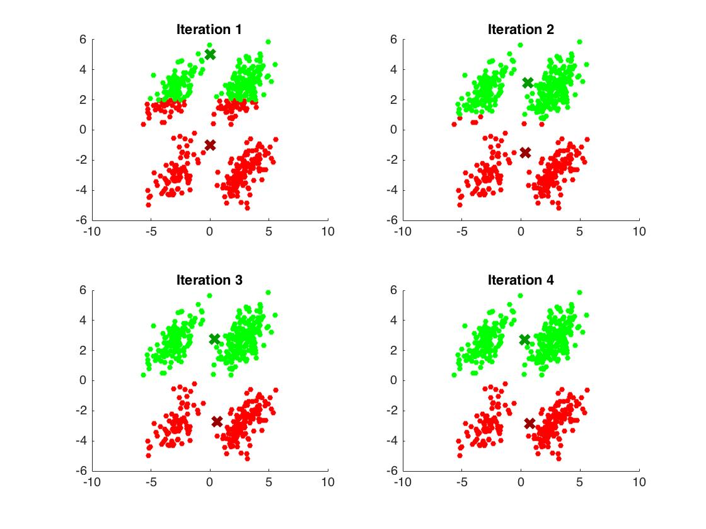
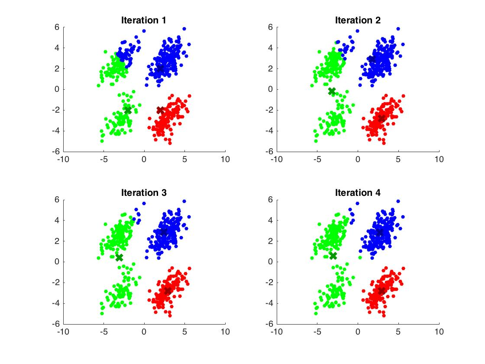
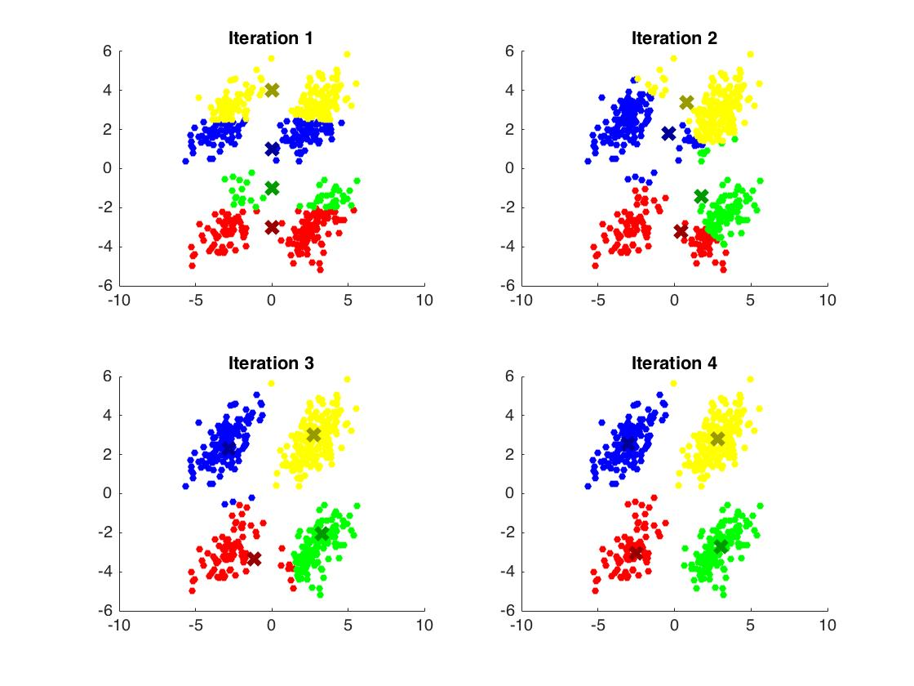
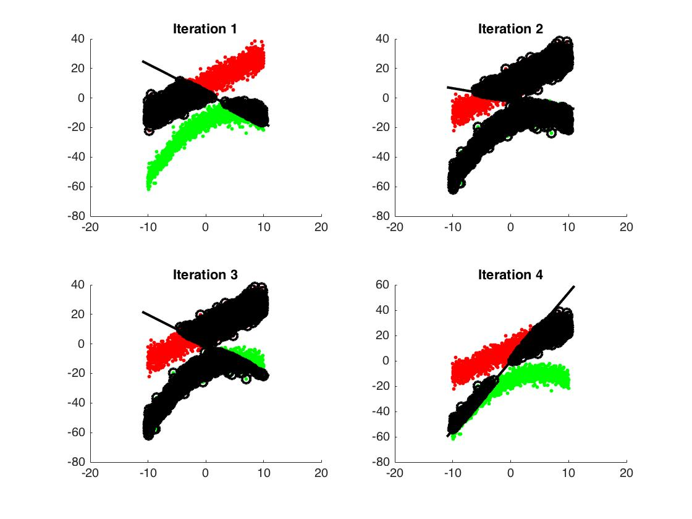
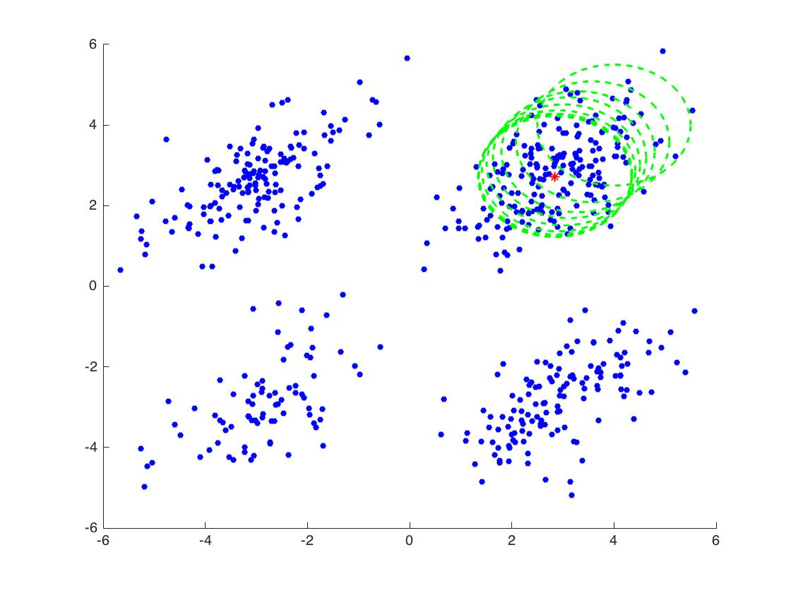
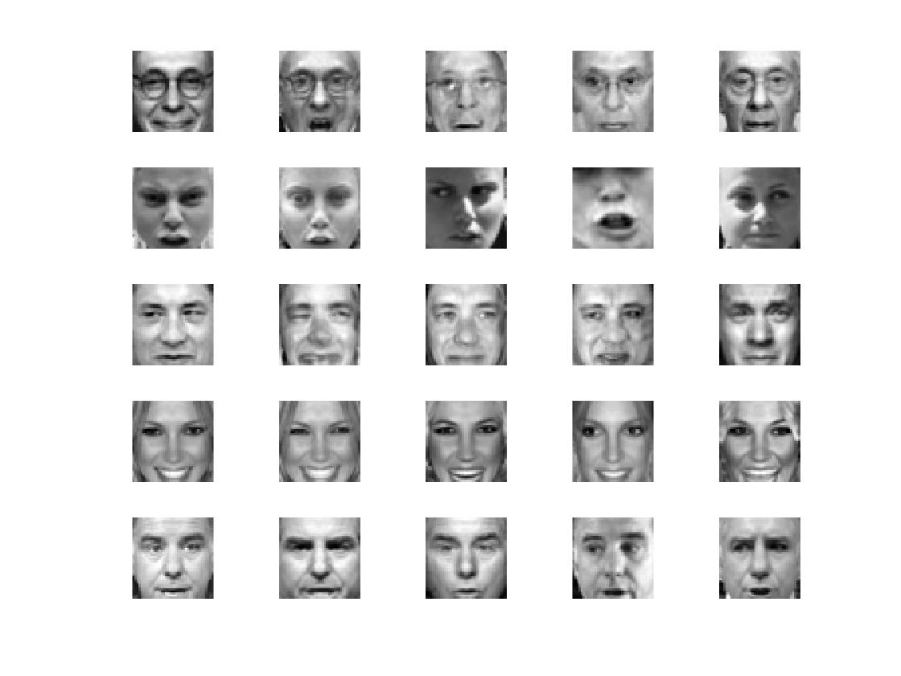
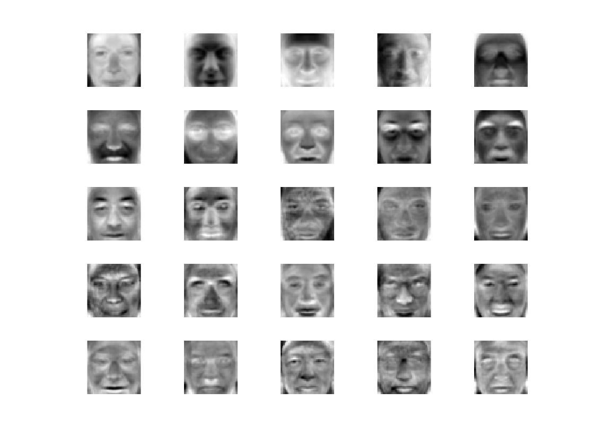
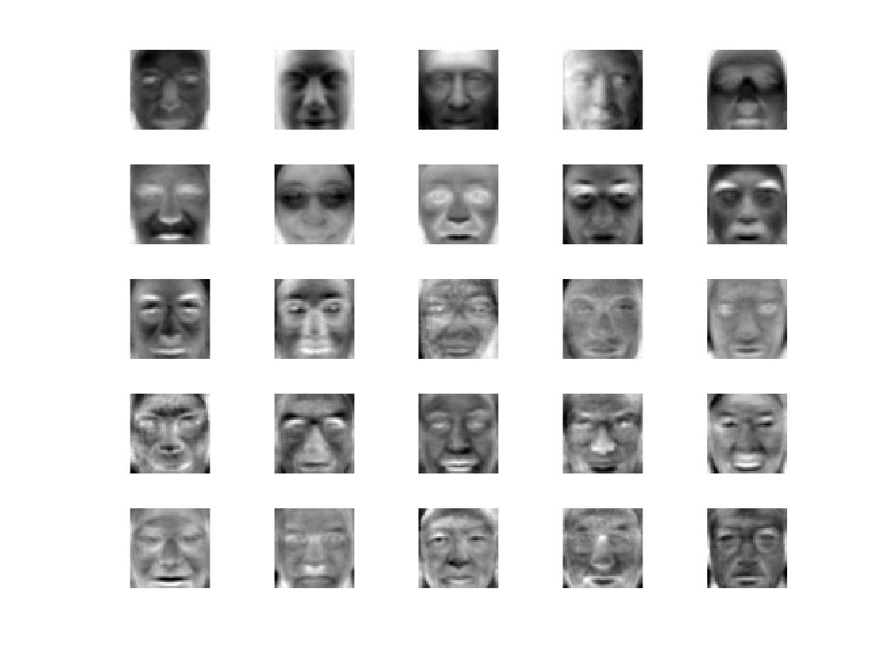
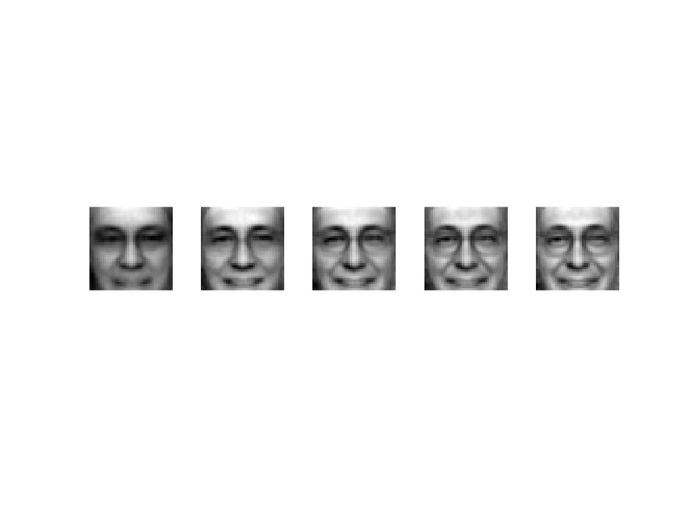

#Data Analysis

> **k means clustering**
 
>- Compute the likelihood function based on **mixture distance function** and Implement K means clustering with visual representation with the **Euclidian distance** likelihood function.

 
 
 

> **Perceptron**

>-  Implement Perceptron for **binary classification** tasks with visual representation.

 

> **mean-shift clustering**

>- Implement mean-shift clustering with visual representation.

 

> **PCA on Yale Face Database**

>- Implement eigen faces by using the built-in function PCA in MATLAB and implement PCA by using svd and eig function in MATLAB.

 
 
 
 

> **Regression Exercises**

>- Implement **linear regression**, second order polynomial regression, **higher-orders polynomial regression** and **error analysis** for predicting news popularity. ( Dataset download from UCI Machine Learning Repository. )
